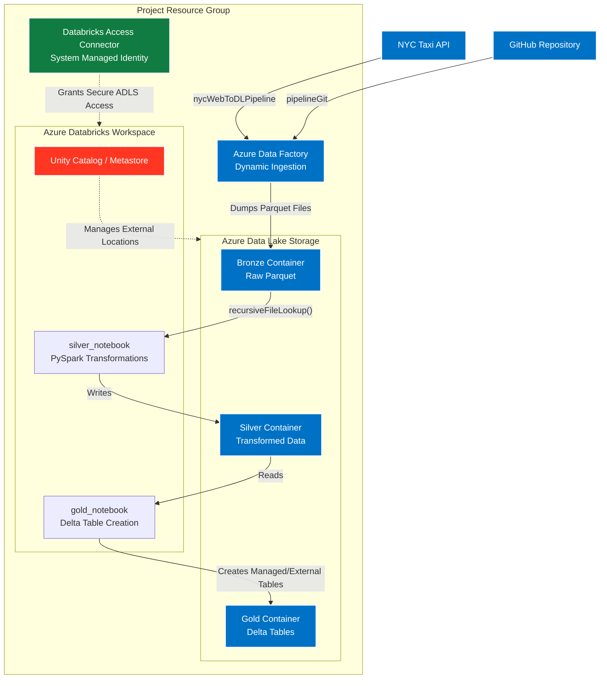

# ☁️ Azure Medallion Architecture: ADF, Databricks & Unity Catalog

> An end-to-end data engineering solution implementing the Medallion Architecture (Bronze, Silver, Gold). This project utilizes Azure Data Factory for dynamic API and GitHub ingestion, and Azure Databricks (PySpark) managed by Unity Catalog for advanced data transformations and Delta Lake table creation.

---

## 🏗️ Architecture Overview

The ingestion layer is driven by Azure Data Factory, dynamically pulling NYC Taxi API data and GitHub files into a Bronze Data Lake container. Azure Databricks securely connects to the Data Lake via an Access Connector, processing the data through the Silver and Gold layers using PySpark and advanced Delta features.

## 🚀 Deployed Resources

| Resource Type | Purpose in Project |
| :--- | :--- |
| **Azure Data Factory (ADF)** | Handles the orchestration of raw data extraction from external web and API sources into the Data Lake. |
| **Azure Databricks Workspace** | The core compute environment executing PySpark transformations and advanced Delta Lake commands. |
| **Databricks Access Connector** | Employs a System Managed Identity to provide Databricks and Unity Catalog secure, keyless access to the Data Lake. |
| **Azure Data Lake Storage (ADLS)** | The central storage layer logically separated into `Bronze`, `Silver`, and `Gold` zones. |

## 🏅 Medallion Architecture Implementation

### 1. Bronze Layer (Raw Ingestion via ADF)
Azure Data Factory contains two primary pipelines to land raw data:

* **`pipelineGit`:** A direct pipeline fetching `trip_type` and `trip_zone` lookup tables directly from GitHub.

* **`nycWebToDLPipeline`:** A highly dynamic pipeline designed to fetch `trip_data` from the NYC Taxi API. It utilizes parameterized datasets, parameterized linked services, a **ForEach Activity**, and an **If Condition** to dynamically iterate and dump the API payload as Parquet files into the Bronze container.

### 2. Silver Layer (Transformation via PySpark)
* **`silver_notebook`:** Reads the raw Parquet data from the Bronze container. 
* To handle multiple ingestion files for the NYC taxi data, I utilized PySpark's **`recursiveFileLookup`** option, which smoothly scans all subdirectories in the Bronze container. 
* Applied necessary data cleaning and transformations using PySpark dataframes, then wrote the refined data into the Silver container.

### 3. Gold Layer (Business Models via Unity Catalog & Delta)
* **`gold_notebook`:** Focuses on creating the Catalog, Schemas, and final Delta tables for `trip_data`, `trip_type`, and `trip_zone`.
* **Advanced Delta Features:** Used this layer to implement and test core Delta Lake mechanics, including:
  * **Time Travel & Versioning:** Querying historical states of the data.
  * **Cloning:** Utilizing both Deep and Shallow clones for testing.
  * **Optimization:** Running the `OPTIMIZE` command to compact files.
  * **Deletion Vectors & Tombstoning:** Analyzing how Delta efficiently handles row-level deletions and physical file cleanup under the hood.

## 🔐 Security & Unity Catalog Setup

Instead of relying on hardcoded access keys, this project implements a secure, modern access model:
1. Created a **Unity Catalog Metastore** linked to the Databricks workspace.
2. Configured the Metastore with a managed storage path pointing to the ADLS container.
3. Utilized the **Databricks Access Connector** ID to create a secure **Storage Credential**.
4. Built an **External Location** on top of the storage credential, allowing the Databricks workspace to securely read and write Data Lake files purely via managed identity RBAC permissions.

## 💡 Key Learnings

* **Dynamic ADF Pipelines:** Parameterizing linked services and datasets inside ForEach loops makes Data Factory infinitely more scalable than hardcoding individual API endpoints.
* **PySpark File Discovery:** Using `recursiveFileLookup` in PySpark is a highly efficient way to process nested, partitioned data dumps arriving from ADF.
* **Modern Databricks Governance:** Setting up Unity Catalog and External Locations via Access Connectors ensures enterprise-grade security, abstracting away the risk of exposed storage keys.
